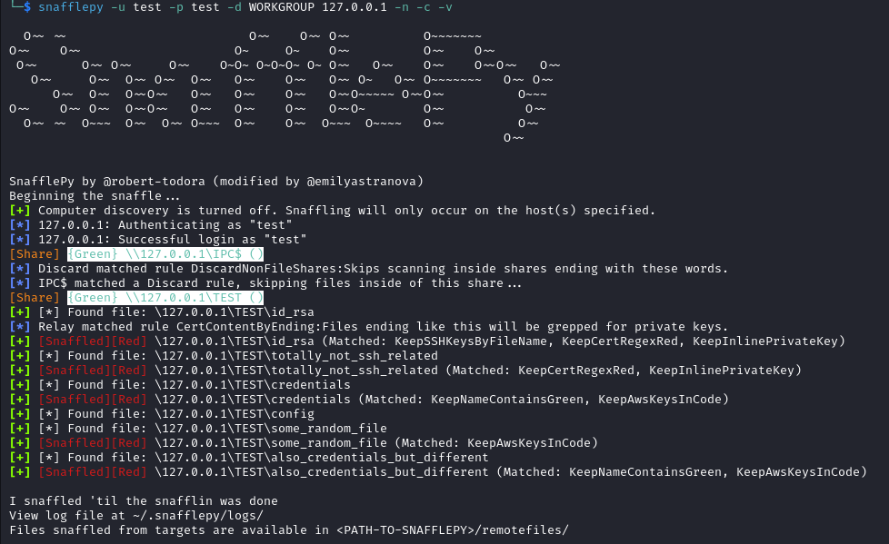

# SnafflePy
A Python-based reimagining of [Snaffler](https://github.com/SnaffCon/Snaffler), designed for finding sensitive information on Windows and Active Directory environments.

This tool works by first authenticating to a target machine and, if enabled, using LDAP to discover other domain-joined computers. It then connects to each target via SMB to enumerate shares and files, using a powerful rule-based engine to identify and retrieve sensitive data.

### Current Features:
- **Cross-Platform:** Run SnafflePy from any machine that can run Python.
- **Flexible Targeting:** Specify targets by IP, hostname, CIDR range, or from a file.
- **Automatic Discovery:** Discovers other domain-joined computers via LDAP queries to quickly expand the search scope. This can be disabled for more targeted scans.
- **Advanced Classification Engine:** Utilizes a sophisticated, rule-based system (inspired by the original Snaffler) to identify interesting files based on:
    - Share names
    - Directory names
    - File names
    - File content (e.g., regex for credentials, SSNs, private keys)
- **Customizable Rules:** Comes with a robust set of default rules, but you can easily provide your own custom rule directory to tailor the search to your needs.
- **Multiple Authentication Methods:** Supports password, NTLM hash, Guest, and NULL session authentication.
- **Informative Output:** Provides clear, color-coded output indicating which files were found and which were "snaffled" (downloaded), along with the specific rules that were matched.

### Features to Add:
1. Make it way faster
2. Output to JSON

## Use Case:

Sometimes you don't have access to a domain-joined Windows machine when you want to find sensitive files on a network. With SnafflePy, you can run your enumeration from any system with Python installed.

## Installation (Linux):

The recommended way to install SnafflePy is with `pipx` to ensure it's available globally in your environment without dependency conflicts.

1.  Install `pipx`: `python3 -m pip install --user pipx`
2.  Install SnafflePy: `pipx install .`
3.  Run it! `snafflepy --help`

Alternatively, you can install it in a local virtual environment:
1.  `python3 -m venv venv`
2.  `source venv/bin/activate`
3.  `pip install -r requirements.txt`

## Usage and Options
```
SnafflePy by @robert-todora (modified by @emilyastranova)
usage: snaffler.py [-h] [-u USERNAME] [-p PASSWORD] [-d DOMAIN] [-H HASH] [-v] [--go-loud] [-m size] [-n] [--no-download] [-c] [-r RULES] targets [targets ...]

A "port" of Snaffler in python

positional arguments:
  targets               IPs, hostnames, CIDR ranges, or files contains targets to snaffle. If you are providing more than one target, the -n option must be used.

options:
  -h, --help            show this help message and exit
  -u USERNAME, --username USERNAME
                        domain username
  -p PASSWORD, --password PASSWORD
                        password for domain user
  -d DOMAIN, --domain DOMAIN
                        FQDN domain to authenticate to, if this option is not provided, SnafflePy will attempt to automatically discover the domain for you
  -H HASH, --hash HASH  NT hash for authentication
  -v, --verbose         Show all files found, not just the ones that are snaffled.
  --go-loud             Don't try to find anything interesting, literally just go through every computer and every share and print out as many files as possible. Use at your own risk
  -m size, --max-file-snaffle size
                        Max filesize to snaffle in bytes (any files over this size will be dropped)
  -n, --disable-computer-discovery
                        Disable computer discovery, requires a list of hosts to do discovery on
  --no-download         Don't download files. Just identify and report matches based on file/share/dir names. Content-based rules will not be evaluated.
  -c, --classification  Enable classification of files (Requires rules!)
  -r RULES, --rules RULES
                        Path to custom rules directory
```

## Examples

1.  **Standard Snaffle:** Automatically discover the domain, find other computers, and use the default rules to find and download interesting files. The `-v` flag shows all files found, while the final output will show which ones were snaffled.

    `snafflepy <IP> -u <username> -p <password> -v -c`

2.  **Targeted Scan, No Download:** Scan a specific host without discovering others (`-n`) and without downloading any files (`--no-download`). This will only report matches based on share, directory, and file names.

    `snafflepy 192.168.1.10 -u <username> -p <password> -n -c --no-download`

## Output

The output is color-coded for readability. When a file is downloaded, it's marked as `[Snaffled]` and includes the color-coded triage level and a list of all the rules it matched.




Thank you to MANSPIDER for the helpful code that I stole: https://github.com/blacklanternsecurity/MANSPIDER

Tested with Python 3.10.6

## Author Information
Robert Todora - robert.todora@cisa.dhs.gov
